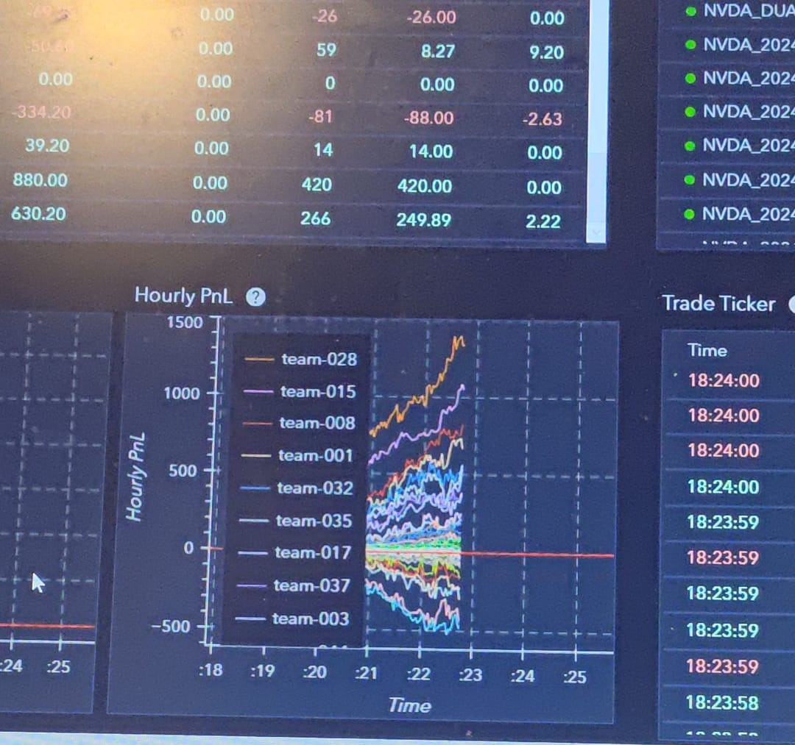

# Market Making Algorithm

## Description
This page lays out the work done to develop an algorithmic trading model that ranked 3rd place in an Optiver trading competition.

This `readme` is not an exhaustive explanation of the code, which is in total more than 400 lines, but serves to give an understanding of the strategy taken, as well as a brief description of the important functions.

## Strategy
The model has the capacity to take active arbitrage opportunities, but focuses on a passive strategy and maintains itself market neutral - which is the core concept of Market Making that we had to demonstrate in the competition.

The idea is to accurately estimate, using a combination of weighted averages from the current bids and aks, the price of the underlying stock. From that, we can use the Black Scholes Equation to calculate the price of our options. Multiple coefficients are used to calculate our "confidence ratio" and estimate the volume of our trades, limiting the exposure of our position at each instance.

Another key aspect is the way we maintain the portfolio Delta Neutral. Again, using Black Scholes we estimate our current Delta, but instead of actively acting to go back to neutrality, we take our delta into account when positioning further bids or asks, and adjust the volume accordingly. This ensures that we don't "waste" interactions actively trading, and we focus on constantly placing passive bets that we are confident lead to positive changes in the PnL.

## Code 
Some of the functions in the code rely on the Optibook python library, but the core idea of the Strategy is fully interchangable to any other environment. The code is attached in the GitHub repo as algo.py.

There are 2 main functions to take an action in a given orderbook:
- `active_trade` that seeks for arbitrage opporunities and inmediately acts upon those. Arbitrage oportunities are scanned between Dualstocks, where there should be a 1:1 correlation between the prices

- `place_bid_ask_spread` is the leading passive strategy that accounts for the highest part of the performed trades. It is mostly based on 3 parameters:
  - Portfolio's Delta: we want our portfolio to remain Delta neutral. We dynamically act to place the volume of our bets to move our delta in the desired direction. We calculate our portfolio's delta with overall_delta and the impact of the stock we are trading with calculate_option_delta (works also for futures).
  - Total Position: During the competition, each team had a limited exposure of 100 positions. This was very important, and to maximize our trades we wanted our position to remain around 0. To solve this, the approach is similar to the one for the delta , where we dynamically adjust the volume of our trades.
  - Confidence Ratio: from volume_weighted_average and using Black Scholes, we estimate the price of the stock we are trading. We derive a confidence ratio, for the gap between the estimated price and the current price - to avoid being overly exposed to fast price fluctuations against our current position.
 
Other functions such as `track_delta` or `track_pnl` are used for monitoring purposes, to ensure that overtime we stay Delta neutral, and to determine the impact of tweaking different components on our PNL. This was a key part in the optimization of our stategy.

This graph measures the hourly PNL rate of each team. We were team-028, and you can clearly see the highest gradiet after implementing a change at :15, which had a positive impact on our performance.

## Things to improve

Overall, the performance of this strategy was excellent. The 2 teams that had a higher position at the end of the competition were using a similar strategy, but also trading indices. We were not aware that index trading was a part of the competition, but we should have spent more time on fully understanding all the possible options allowed.

Nevertheless, this meant that we had the best strategy for purely trading options and futures, and if we had extrapolated the strategy to indices, we could have drastically improved our overall performance.

Also, the active strategy could be improved by taking arbitrage opportunities between options futures and underlying stocks, taking Black Scholes as the relation between those. This was not done as active trading was a minimal part of our PNL, and choose to focus on improving the passive strategy.

